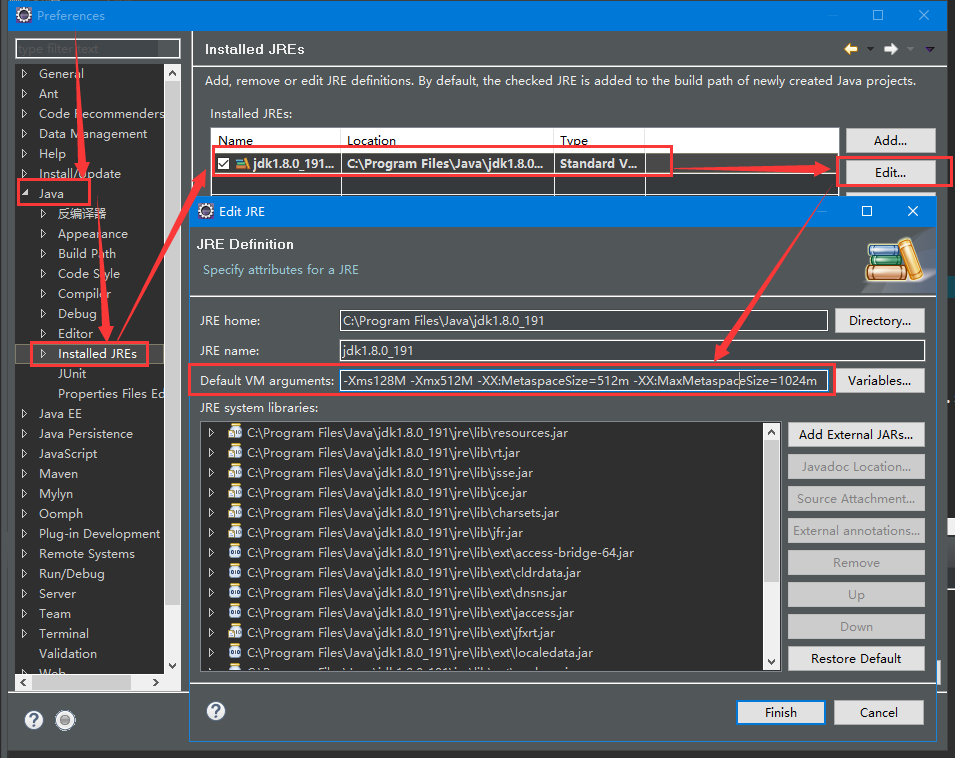
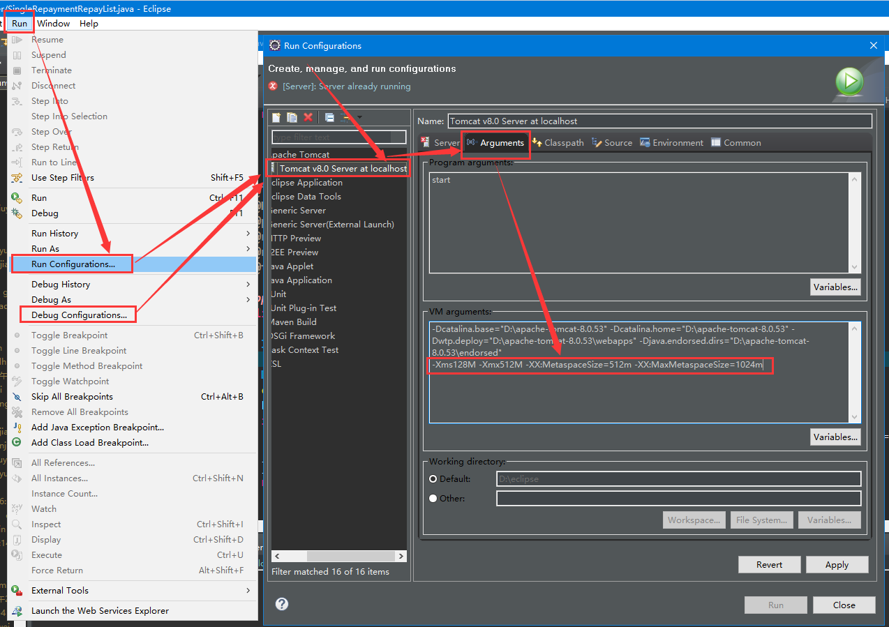
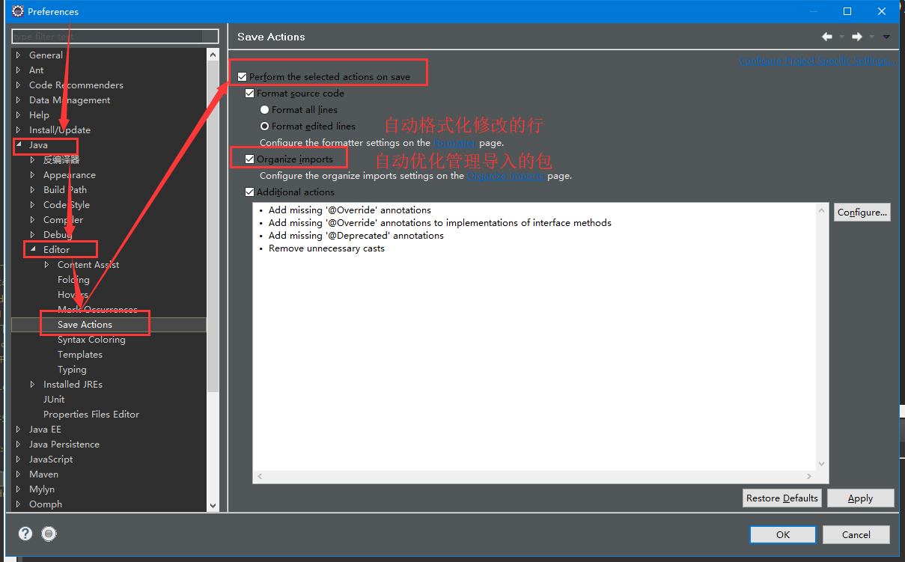
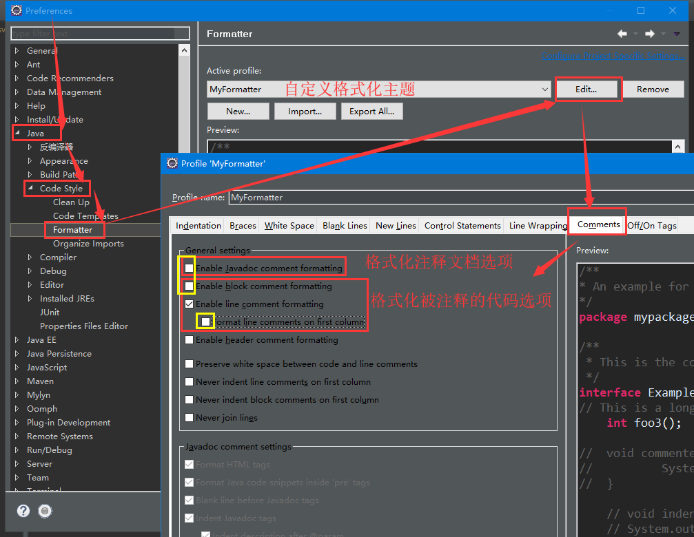
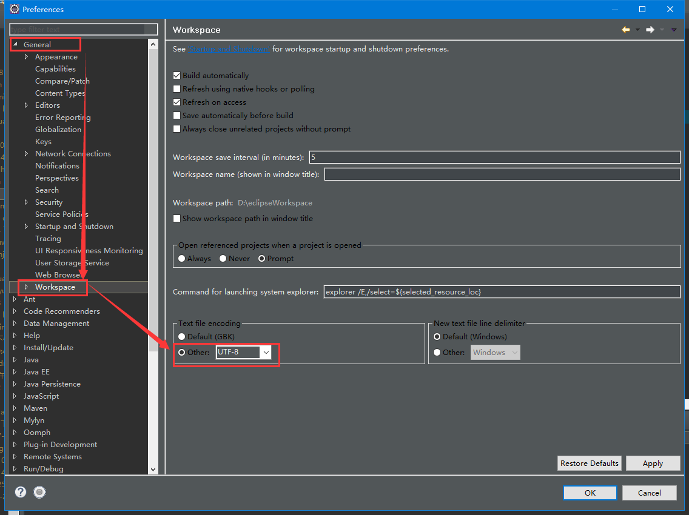
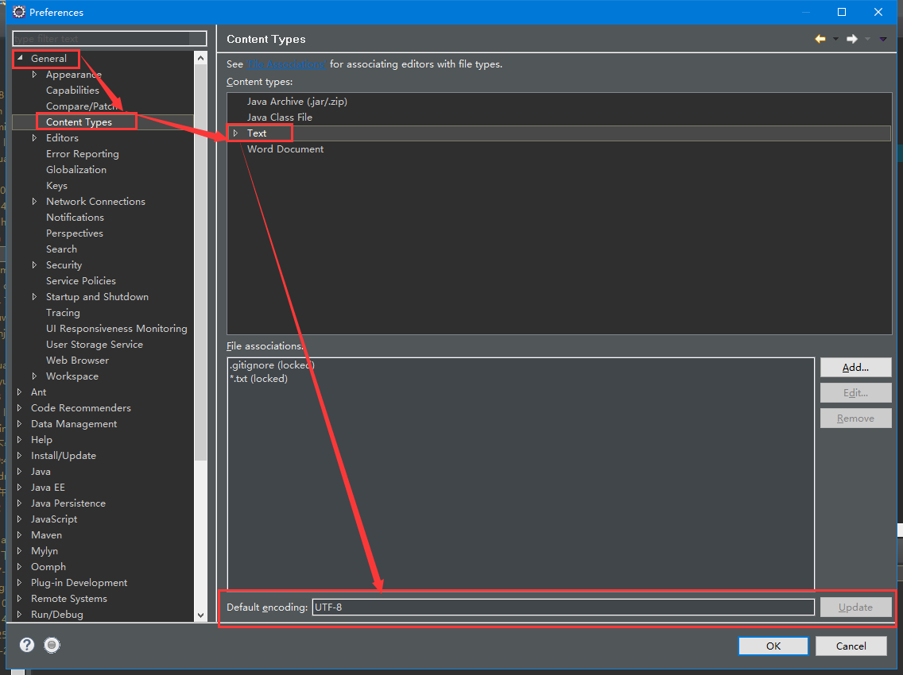
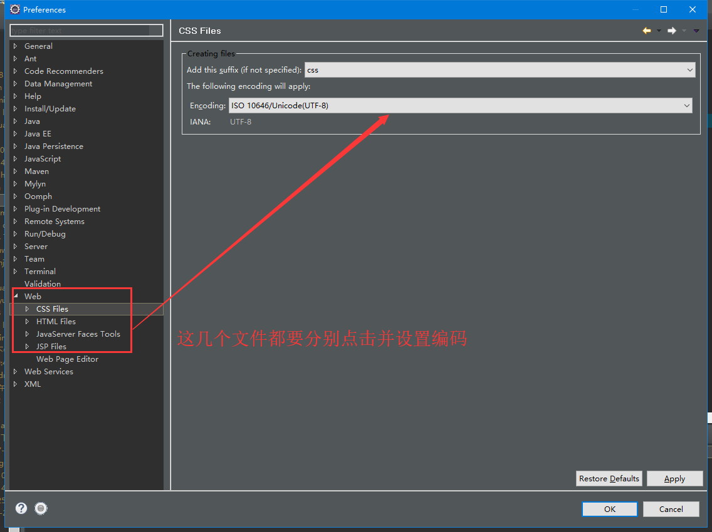
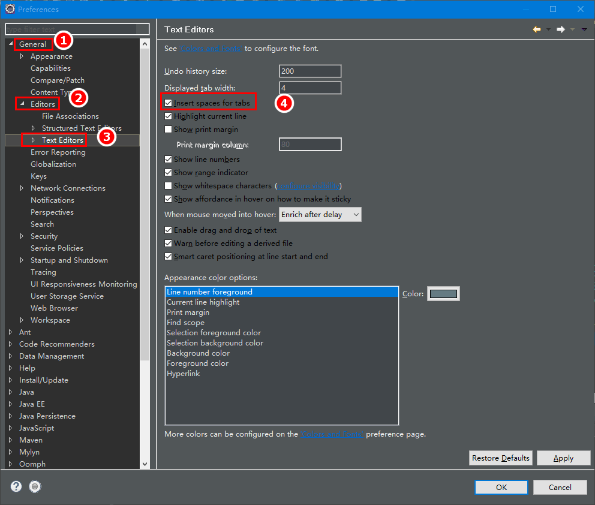
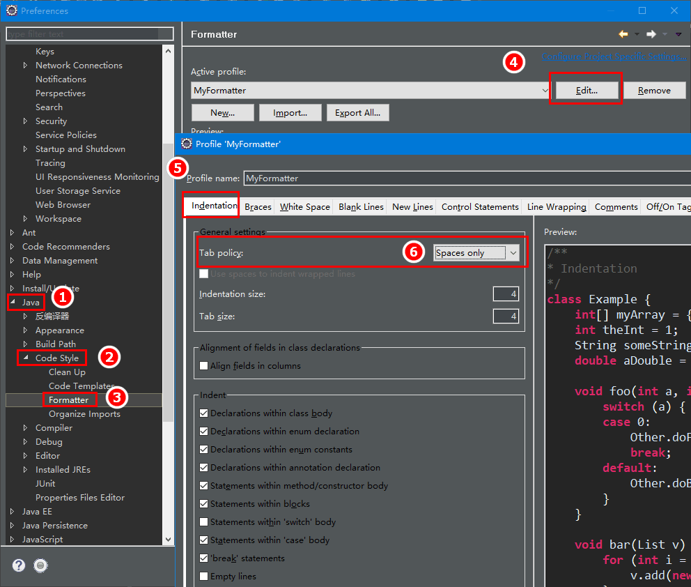

# Eclipse


## flag

* [http://www.eclipse.org/downloads/packages](http://www.eclipse.org/downloads/packages)
* [单行注释自动靠左](https://blog.csdn.net/mp9105/article/details/93343403)


## 版本对应关系

* [http://www.eclipse.org/downloads/packages](http://www.eclipse.org/downloads/packages)
* [https://zh.wikipedia.org/wiki/Eclipse](https://zh.wikipedia.org/wiki/Eclipse)


| 版本代号 	| 版本 	| 主要发行日期 	| SR1发行日期   	| SR2发行日期    	| N/A           	| JDK最低版本 	|
|----------	|----------	|------------------	|---------------	|----------------	|---------------	|-------------------	|
| Callisto 	| 3.2      	| 2006年6月26日    	| N/A           	| N/A            	| N/A           	| JDK1.4            	|
| Europa   	| 3.3      	| 2007年6月27日    	| 2007年9月28日 	| 2008年2月29日  	| N/A           	| JDK1.5            	|
| Ganymede 	| 3.4      	| 2008年6月25日    	| 2008年9月24日 	| 2009年2月25日  	| N/A           	| JDK1.5            	|
| Galileo  	| 3.5      	| 2009年6月24日    	| 2009年9月25日 	| 2010年2月26日  	| N/A           	| JDK1.5            	|
| Helios   	| 3.6      	| 2010年6月23日    	| 2010年9月24日 	| 2011年2月25日  	| N/A           	| JDK1.5            	|
| Indigo   	| 3.7      	| 2011年6月22日    	| 2011年9月23日 	| 2012年2月24日  	| N/A           	| JDK1.5            	|
| Juno     	| 3.8及4.2 	| 2012年6月27日    	| 2012年9月28日 	| 2013年3月1日   	| N/A           	| JDK1.5            	|
| Kepler   	| 4.3      	| 2013年6月26日    	| 2013年9月27日 	| 2014年2月28日  	| N/A           	| JDK1.6            	|
| Luna     	| 4.4      	| 2014年6月25日    	| 2014年9月25日 	| 2015年2月27日  	| N/A           	| JDK1.6            	|
| Mars     	| 4.5      	| 2015年6月24日    	| 2015年9月22日 	| 2016年2月24日  	| N/A           	| JDK1.7            	|
| 版本代号 	| 版本 	| 主要发行日期 	| 9月份 (*.1)   	| 12月份 (*.2)   	| 3月份 (*.3)   	| JDK最低版本 	|
| Neon     	| 4.6      	| 2016年6月22日    	| 2016年9月28日 	| 2016年12月21日 	| 2017年3月23日 	| JDK1.8            	|
| Oxygen   	| 4.7      	| 2017年6月28日    	| 2017年9月27日 	| 2017年12月20日 	| 2018年3月21日 	| JDK1.8      	|
| Photon   	| 4.8      	| 2018年6月27日    	| 2018年9月     	| 2018年12月     	| 2019年3月     	| JDK1.8      	|


## 显示内存

> 在eclipse中打开heap状态`windows->perference->general->右边show heap status打上勾->OK `，这时会在Eclipse最下面显示一个内存显示了

## 解决卡死现象

> Eclipse中jsp、js文件编辑时，卡死现象解决

- 1、取消验证

> `windows`–>`perferences`–>`validation`
>
> 把除了`manual`下面的全部点掉，`build`下只留`classpath dependency Validator`
 
- 2、关闭拼写检查

> `windows`–>`perferences`–>`general`–>`editors`->`Text Editors`->`spelling`

## 调整Eclipse运行内存

> 在eclipse的安装目录下编辑`eclipse.ini`文件
 
[JVM参数设置](../Java/Tomcat.md)

```bash
# JDK8以下
-Xms128M -Xmx512M -XX:PermSize=64M -XX:MaxPermSize=128M
# JDK8
-Xms128M -Xmx512M -XX:MetaspaceSize=512m -XX:MaxMetaspaceSize=1024m
```

```diff
-Xms128m JVM初始分配的堆内存
-Xmx512m JVM最大允许分配的堆内存，按需分配
-XX:PermSize=64M JVM初始分配的非堆内存，JDK8之前
-XX:MaxPermSize=128M JVM最大允许分配的非堆内存，按需分配，JDK8之前
-XX:MetaspaceSize=512m 元数据，JDK8
-XX:MaxMetaspaceSize=1024m 最大元数据，JDK8
```

#### 设置JDK参数



#### 设置Tomcat参数




## Eclipse自动导包设置

> 在Eclispe中，打开`Window`->`Preferences`->`Java`->`Editor`->`Save Actions`然后选中`Organize impots`




## Eclipse注释模板设置

> 编辑注释模板的方法：`Window`->`Preference`->`Java`->`Code Style`->`Code Template`然后展开`Comments`节点就是所有需设置注释的元素

- 注释的使用：输入`/**`然后回车自动出来


- 创建新文件(New Java files)注释标签

```txt

${filecomment}
${package_declaration}


/**
 * @Title: ${file_name}
 * @Package ${package_name}
 * @Description: 
 * @author: woytu.com
 * @date: ${date} ${time}
 * @version V1.0
 * @Copyright: ${year} woytu.com Inc. All rights reserved.
 */
${typecomment}
${type_declaration}
    
```

- 字段(Fields)注释标签

```java
 /**
 * @Fields ${field} : 
 * @author: woytu.com
 * @date: ${date} ${time}
 */
```

- 构造函数(Constructors)标签

```java
/**
 * @Title: ${enclosing_type}
 * ${tags}
 * @author: woytu.com
 * @date: ${date} ${time}
 */
```

- 方法(Methods)标签

```java
/**
 * 
 * ${tags} ${return_type}
 * @author: woytu.com
 * @date: ${date} ${time}
 */
```

- 覆盖方法(Overriding Methods)标签

```java
/**
 * <p>Title: ${enclosing_method}</p>
 * <p>Description: </p>
 * ${tags}
 * ${see_to_overridden}
 * @author: woytu.com
 * @date: ${date} ${time}
 */
```

- 代表方法(Delegate Methods)标签

```java
/**
 * ${tags}
 * ${see_to_target}
 * @author: woytu.com
 * @date: ${date} ${time}
 */
```

- getter方法标签

```java
/**
 * @Title: ${enclosing_method} <BR>
 * @Description: please write your description <BR>
 * @return: ${field_type} <BR>
 * @author: woytu.com
 * @date: ${date} ${time}
 */
```

- setter方法标签

```java
/**
 * @Title: ${enclosing_method} <BR>
 * @Description: please write your description <BR>
 * @return: ${field_type} <BR>
 * @author: woytu.com
 * @date: ${date} ${time}
 */
```

## Eclipse代码格式化设置

```txt
1.Window->Preferences

// Java 格式化
2.Java->Code Style->Formatter->New->Edit->Line Wrapping
3.Maximum Line width = 180
4.Set line width for preview window = 180

5.Java->Code Style->Formatter->New->Edit->Comments
6.Maximum line width for comments = 180

// JavaScript 格式化
2.JavaScript->Code Style->Formatter->New->Edit->Line Wrapping
3.Maximum Line width = 180
4.Set line width for preview window = 180

5.JavaScript->Code Style->Formatter->New->Edit->Comments
6.Maximum line width for comments = 180

// JSP|HTML页面 格式化
2.Web->HTML Files->Editor
3.Line width = 180
4.Inline Elements 选中所有-> Remove
```


## Eclipse设置不格式化注释

> Eclipse默认自带的风格模板不能直接操作，需要先创建一个新的风格模板才能操作



## 设置编码格式

- 设置工作空间编码格式

> 在`Window`->`Preferences`->`General`->`Workspace下`，面板`Text file encoding`选择`UTF-8`

>

- 设置文档编码格式

> 在`Window`->`Preferences`->`General`->`Content Type`->`Text`的最下面设置为编码格式为`UTF-8`



- 设置Web编码格式

> 在`Window`->`Preferences`->`Web`->`CSS Files、HTML Files、JSP Files` 面板选择`ISO 10646/Unicode(UTF-8)`



- 设置项目的文档编码格式

> 选择`项目`->`右键`->`Properties`->`Resource`设置编码为`UTF-8`


## 设置Tab键为4个空格






## 快捷键设置

> `Window`->`Preference`->`General`->`Keys`

- 设置复制一行

> 搜索`Ctrl+Alt+Down`或者`Copy Lines`即可修改


## 插件

- 反编译`Eclipse Class Decompiler`