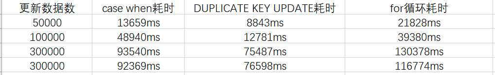
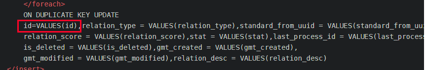

探讨批量更新数据三种写法的效率问题。

实现方式有三种，

一种用for循环通过循环传过来的参数集合，循环出N条sql，

另一种 用mysql的case when 条件判断变相的进行批量更新  

还有一个是用ON DUPLICATE KEY UPDATE进行批量更新

下面进行实现。

注意第一种方法要想成功，需要在db链接url后面带一个参数  &allowMultiQueries=true

即：  jdbc:mysql://localhost:3306/mysqlTest?characterEncoding=utf-8&allowMultiQueries=true

其实这种东西写过来写过去就是差不多一样的代码，不做重复的赘述，直接上代码。

```xml
 
    <!-- 批量更新第一种方法，通过接收传进来的参数list进行循环着组装sql -->
     <update id="updateBatch" parameterType="java.util.List" >
        <foreach collection="list" item="item" index="index" open="" close="" separator=";">
            update standard_relation
            <set >
                <if test="item.standardFromUuid != null" >
                    standard_from_uuid = #{item.standardFromUuid,jdbcType=VARCHAR},
                </if>
                <if test="item.standardToUuid != null" >
                    standard_to_uuid = #{item.standardToUuid,jdbcType=VARCHAR},
                </if>
                <if test="item.gmtModified != null" >
                    gmt_modified = #{item.gmtModified,jdbcType=TIMESTAMP},
                </if>
            </set>
            where id = #{item.id,jdbcType=BIGINT}
        </foreach>
    </update>
 
    <!-- 批量更新第二种方法，通过 case when语句变相的进行批量更新 -->
    <update id="updateBatch" parameterType="java.util.List" >
        update standard_relation
        <trim prefix="set" suffixOverrides=",">
            <trim prefix="standard_from_uuid =case" suffix="end,">
                <foreach collection="list" item="i" index="index">
                    <if test="i.standardFromUuid!=null">
                        when id=#{i.id} then #{i.standardFromUuid}
                    </if>
                </foreach>
            </trim>
            <trim prefix="standard_to_uuid =case" suffix="end,">
                <foreach collection="list" item="i" index="index">
                    <if test="i.standardToUuid!=null">
                        when id=#{i.id} then #{i.standardToUuid}
                    </if>
                </foreach>
            </trim>
            <trim prefix="gmt_modified =case" suffix="end,">
                <foreach collection="list" item="i" index="index">
                    <if test="i.gmtModified!=null">
                        when id=#{i.id} then #{i.gmtModified}
                    </if>
                </foreach>
            </trim>
        </trim>
        where
        <foreach collection="list" separator="or" item="i" index="index" >
            id=#{i.id}
        </foreach>
    </update>
    <!-- 批量更新第三种方法，用ON DUPLICATE KEY UPDATE -->
 <insert id="updateBatch" parameterType="java.util.List">
        insert into standard_relation(id,relation_type, standard_from_uuid,
        standard_to_uuid, relation_score, stat,
        last_process_id, is_deleted, gmt_created,
        gmt_modified,relation_desc)VALUES
        <foreach collection="list" item="item" index="index" separator=",">
            (#{item.id,jdbcType=BIGINT},#{item.relationType,jdbcType=VARCHAR}, #{item.standardFromUuid,jdbcType=VARCHAR},
            #{item.standardToUuid,jdbcType=VARCHAR}, #{item.relationScore,jdbcType=DECIMAL}, #{item.stat,jdbcType=TINYINT},
            #{item.lastProcessId,jdbcType=BIGINT}, #{item.isDeleted,jdbcType=TINYINT}, #{item.gmtCreated,jdbcType=TIMESTAMP},
            #{item.gmtModified,jdbcType=TIMESTAMP},#{item.relationDesc,jdbcType=VARCHAR})
        </foreach>
        ON DUPLICATE KEY UPDATE
        id=VALUES(id),relation_type = VALUES(relation_type),standard_from_uuid = VALUES(standard_from_uuid),standard_to_uuid = VALUES(standard_to_uuid),
        relation_score = VALUES(relation_score),stat = VALUES(stat),last_process_id = VALUES(last_process_id),
        is_deleted = VALUES(is_deleted),gmt_created = VALUES(gmt_created),
        gmt_modified = VALUES(gmt_modified),relation_desc = VALUES(relation_desc)
    </insert>
```

```java
public class Test{
    @Override
    public void updateStandardRelations() {
        List<StandardRelation> list=standardRelationMapper.selectByStandardUuid("xiemingjieupdate");
        for(StandardRelation tmp:list){
            tmp.setStandardFromUuid(tmp.getStandardFromUuid()+"update");
            tmp.setStandardToUuid(tmp.getStandardToUuid()+"update");
        }
        long begin=System.currentTimeMillis();
        standardRelationManager.updateBatch(list);
        long end=System.currentTimeMillis();
        System.out.print("当前的批量更新的方法用时"+(end-begin)+"ms");
    }
}
```


sql语句for循环效率其实相当高的，因为它仅仅有一个循环体，只不过最后update语句比较多，量大了就有可能造成sql阻塞。

case when虽然最后只会有一条更新语句，但是xml中的循环体有点多，每一个case when 都要循环一遍list集合，所以大批量拼sql的时候会比较慢，所以效率问题严重。使用的时候建议分批插入。

duplicate key update可以看出来是最快的，但是一般大公司都禁用，公司一般都禁止使用replace into和INSERT INTO … ON DUPLICATE KEY UPDATE，这种sql有可能会造成数据丢失和主从上表的自增id值不一致。而且用这个更新时，记得一定要加上id，而且values（）括号里面放的是数据库字段，不是java对象的属性字段。




### Mybatis中进行批量更新（updateBatch）
#### 更新多条数据,每条数据都不一样
> 背景描述：通常如果需要一次更新多条数据有两个方式，（1）在业务代码中循环遍历逐条更新。（2）一次性更新所有数据（更准确的说是一条sql语句来更新所有数据，逐条更新的操作放到数据库端，在业务代码端展现的就是一次性更新所有数据）。两种方式各有利弊，下面将会对两种方式的利弊做简要分析，主要介绍第二种方式在mybatis中的实现。

##### 逐条更新(效率低)(方法一)
这种方式显然是最简单，也最不容易出错的，即便出错也只是影响到当条出错的数据，而且可以对每条数据都比较可控，更新失败或成功，从什么内容更新到什么内容，都可以在逻辑代码中获取。代码可能像下面这个样子：

```java
public class Test{
	public void test(){
	updateBatch(List<MyData> datas){
    for(MyData data : datas){
        try{
            myDataDao.update(data);//更新一条数据，mybatis中如下面的xml文件的					update
        }
        catch(Exception e){
            ...//如果更新失败可以做一些其他的操作，比如说打印出错日志等
        }
    	}
		}
	}
}

```

//mybatis中update操作的实现
```xml
<update>
    update mydata
    set   ...
    where ...
</update>
```
这种方式最大的问题就是效率问题，逐条更新，每次都会连接数据库，然后更新，再释放连接资源（虽然通过连接池可以将频繁连接数据的效率大大提高，抗不住数据量大），这中损耗在数据量较大的时候便会体现出效率问题。这也是在满足业务需求的时候，通常会使用上述提到的第二种批量更新的实现（当然这种方式也有数据规模的限制，后面会提到）。

##### 逐条更新(方法二)
通过循环，依次执行多条update的sql
* 前提条件:
	- 要实现批量更新，首先得设置mysql支持批量操作，在jdbc链接中需要附加&allowMultiQueries=true属性才行
例如：
jdbc:mysql://localhost:3306/dbname?characterEncoding=utf8&zeroDateTimeBehavior=convertToNull&allowMultiQueries=true
```xml
<update id="updateBatch"  parameterType="java.util.List">
    <foreach collection="list" item="item" index="index" open="" close="" separator=";">
        update course
        <set>
            name=${item.name}
        </set>
        where id = ${item.id}
    </foreach>
</update>
```
一条记录update一次，性能比较差，容易造成阻塞。

##### sql批量更新(一)(主力)
(可行)实际实践(传入的是List<Map<String, Object>>)
++务必注意:一定要加where条件,里面的id为需要更新的数据的id;如果不加where条件,则会全部更新,但是需要更新且有数据的更新为传递的数据,没有数据的则更新为null,此时更新出错++
```xml
<update id="updateChartParamByAccountAndChartid" parameterType="list">
        update followme_parameters
        <trim prefix="set" suffixOverrides=",">
            <trim prefix="signal_source =case" suffix="end,">
                <foreach collection="list" item="item" index="index">
                    <if test="item.signalSource!=null">
                        when account=#{item.account} and chart_id=#{item.chartId}
                         then #{item.signalSource}
                    </if>
                </foreach>
            </trim>
            <trim prefix="rate =case" suffix="end,">
                <foreach collection="list" item="item" index="index">
                    <if test="item.rate!=null">
                        when account=#{item.account} and chart_id=#{item.chartId}
                        then #{item.rate}
                    </if>
                </foreach>
            </trim>
        </trim>
        where id in
        <foreach collection="list" item="item" index="index" separator="," open="(" close=")">
            #{item.id}
        </foreach>
    </update>
```
**下面逐步讲解**
一条sql语句来批量更新所有数据，下面直接看一下在mybatis中通常是怎么写的（去掉mybatis语法就是原生的sql语句了，所有就没单独说sql是怎么写的）。
```xml
<update id="updateBatch" parameterType="java.util.List">
    update mydata_table
    set  status=
    <foreach collection="list" item="item" index="index"
        separator=" " open="case ID" close="end">
        when #{item.id} then #{item.status}
    </foreach>
    where id in
    <foreach collection="list" index="index" item="item"
        separator="," open="(" close=")">
        #{item.id,jdbcType=BIGINT}
    </foreach>
 </update>
```

其中when...then...是sql中的"switch" 语法。这里借助mybatis的语法来拼凑成了批量更新的sql，上面的意思就是批量更新id在updateBatch参数所传递List中的数据的status字段。还可以使用实现同样的功能,代码如下:
```xml
<update id="updateBatch" parameterType="java.util.List">
        update mydata_table
        <trim prefix="set" suffixOverrides=",">
            <trim prefix="status =case" suffix="end,">
                <foreach collection="list" item="item" index="index">
                     when id=#{item.id} then #{item.status}
                </foreach>
            </trim>
        </trim>
        where id in
        <foreach collection="list" index="index" item="item" separator="," open="(" close=")">
            #{item.id,jdbcType=BIGINT}
        </foreach>
    </update>
<trim>
```
**属性说明**
1.prefix,suffix 表示在trim标签包裹的部分的前面或者后面添加内容
2.如果同时有prefixOverrides,suffixOverrides 表示会用prefix,suffix覆盖Overrides中的内容。
3.如果只有prefixOverrides,suffixOverrides 表示删除开头的或结尾的xxxOverides指定的内容。
上述代码转化成sql如下:
```sql
update mydata_table
    set status =
    case
        when id = #{item.id} then #{item.status}//此处应该是<foreach>展开值
        ...
    end
    where id in (...);
```
当然这是最简单的批量更新实现,有时候可能需要更新多个字段,那就需要将
```xml
<trim prefix="status =case" suffix="end,">
     <foreach collection="list" item="item" index="index">
          when id=#{item.id} then #{item.status}
     </foreach>
</trim>
```
复制拷贝多次,更改prefix和when...then...的内容即可.而如果当需要为某个字段设置默认值的时候可以使用else
```xml
<trim prefix="status =case" suffix="end,">
     <foreach collection="list" item="item" index="index">
          when id=#{item.id} then #{item.status}
     </foreach>
     else default_value
</trim>
```
还有更常见的情况就是需要对要更新的数据进行判断,只有符合条件的数据才能进行更新,这种情况可以这么做:
```xml
<trim prefix="status =case" suffix="end,">
     <foreach collection="list" item="item" index="index">
         <if test="item.status !=null and item.status != -1">
             when id=#{item.id} then #{item.status}
         </if>
     </foreach>
</trim>
```
这样的话只有要更新的list中status != null && status != -1的数据才能进行status更新.其他的将使用默认值更新,而不会保持原数据不变.如果要保持原数据不变呢?即满足条件的更新,不满足条件的保持原数据不变,简单的来做就是再加一个,因为mybatis中没有if...else...语法,但可以通过多个实现同样的效果,如下:
```xml
<trim prefix="status =case" suffix="end,">
     <foreach collection="list" item="item" index="index">
         <if test="item.status !=null and item.status != -1">
             when id=#{item.id} then #{item.status}
         </if>
         <if test="item.status == null or item.status == -1">
             when id=#{item.id} then mydata_table.status      //这里就是原数据
         </if>
     </foreach>
</trim>
```
整体批量更新的写法如下:
```xml
<update id="updateBatch" parameterType="java.util.List">
    update mydata_table
    <trim prefix="set" suffixOverrides=",">
        <trim prefix="status =case" suffix="end,">
             <foreach collection="list" item="item" index="index">
                 <if test="item.status !=null and item.status != -1">
                     when id=#{item.id} then #{item.status}
                 </if>
                 <if test="item.status == null or item.status == -1">
                     when id=#{item.id} then mydata_table.status//原数据
                 </if>
             </foreach>
        </trim>
    </trim>
    where id in
    <foreach collection="list" index="index" item="item" separator="," open="(" close=")">
        #{item.id,jdbcType=BIGINT}
    </foreach>
</update>
批量更新(单个字段,传参list),实际是sql批量更新的简化版本而已
单个字段
<update id="updateByBatch" parameterType="java.util.List">
    update t_goods
    set NODE_ID=
    <foreach collection="list" item="item" index="index"
             separator=" " open="case" close="end">
      when GOODS_ID=#{item.goodsId} then #{item.nodeId}
    </foreach>
    where GOODS_ID in
    <foreach collection="list" index="index" item="item"
             separator="," open="(" close=")">
      #{item.goodsId,jdbcType=BIGINT}
    </foreach>
  </update>
单个字段方法二
<update id="updateByBatch" parameterType="java.util.List">
    UPDATE
    t_goods
    SET NODE_ID = CASE
    <foreach collection="list" item="item" index="index">
      WHEN GOODS_ID = #{item.goodsId} THEN #{item.nodeId}
    </foreach>
    END
    WHERE GOODS_ID IN
    <foreach collection="list" index="index" item="item" open="(" separator="," close=")">
      #{item.goodsId}
    </foreach>
  </update>
```
以上单字段更新实际执行：

```sql
UPDATE t_goods SET NODE_ID = CASE WHEN GOODS_ID = ? THEN ? END WHERE GOODS_ID IN ( ? )
```
sql批量更新(二)
传入的是List<Map<String,Object>>
直接运行插入,如果有插入的数据转为更新该条数据
```xml
<insert id="updateChartParamByAccountAndChartid">
    insert into followme_parameters
    (account,chart_id,signal_source,rate)
    values
    <foreach collection="list" separator="," index="index" item="item">
        (#{item.account},#{item.chartId},#{item.signalSource},#{item.rate})
    </foreach>
    ON duplicate KEY UPDATE
    signal_source=values(signal_source),rate=values(rate)

</insert>
```
更新多条数据,更新的内容一样.
方法一,传map/ 传String
NODE_ID从map中取出来,goodsIdList是字符串拼接好的(如下面的"1,2,5")
```xml
<update id="updateByBatchPrimaryKey" parameterType="java.util.Map">
    UPDATE t_goods
    SET NODE_ID = #{nodeId}
    WHERE GOODS_ID IN (${goodsIdList})
  </update>
```
实际的sql
```sql
UPDATE t_goods SET NODE_ID = ? WHERE GOODS_ID IN (1,2,5);
```
方法二,传map/传list
NODE_ID从map中取出来,goodsIdList是用list拼接出来的
```xml
<update id="updateByBatchPrimaryKey" parameterType="java.util.Map">
    UPDATE t_goods
    SET NODE_ID = #{nodeId}
    WHERE GOODS_ID IN
    <foreach collection="list" index="index" item="item" open="(" separator="," close=")">
      #{item.goodsId}
    </foreach>
</update>
```
实际的sql
```sql
UPDATE t_goods SET NODE_ID = ? WHERE GOODS_ID IN (1,2,5);
```