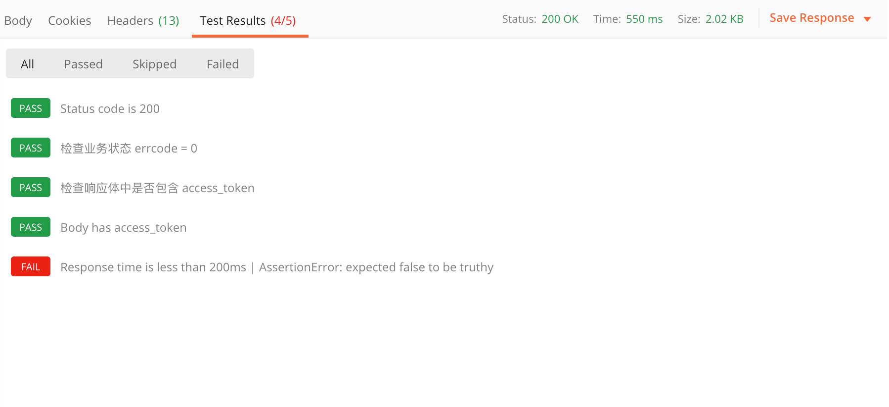

### Postman-Tests模块测试方法记录

> 用Postman的时候大多数测试结果是可以用Tests模块的测试方法来代替人工检查的，测试方法本质上是JavaScript代码，  
> 我们可以通过运行测试用例（测试脚本是在发送请求之后并且从服务器接收到响应时执行），观察结果是“PASS”还是“FAIL”就能判断测试结果：



#### 在此记录一些常用方法备忘（当遇到需要判断返回值为**A或B**的时候，使用“||”符号）：

1. 设置环境变量
```javascript
pm.environment.set("variable_key", "variable_value");
```
2.  将一个嵌套的对象设置为一个环境变量
```javascript
var array = [1, 2, 3, 4];

pm.environment.set("array", JSON.stringify(array, null, 2));

var obj = { a: [1, 2, 3, 4], b: { c: 'val' } };

pm.environment.set("obj", JSON.stringify(obj))
```
3. 获得一个环境变量
```javascript
pm.environment.get("variable_key");
````
4. 获得一个环境变量(其值是一个字符串化的对象)
```javascript
// These statements should be wrapped in a try-catch block if the data is coming from an unknown source.

var array = JSON.parse(pm.environment.get("array"));

var obj = JSON.parse(pm.environment.get("obj"));
```
5. 清除一个环境变量
```javascript
pm.environment.unset("variable_key");
```
6. 设置一个全局变量
```javascript
pm.globals.set("variable_key", "variable_value");
```
7. 获取一个全局变量
```javascript
pm.globals.get("variable_key");
```
8. 清除一个全局变量
```javascript
pm.globals.unset("variable_key");
```
9. 获取一个变量(该函数在全局变量和活动环境中搜索变量)
```javascript
pm.variables.get("variable_key");
```
10. 检查响应主体是否包含字符串
```javascript
pm.test("Body matches string", function () {

pm.expect(pm.response.text()).to.include("string_you_want_to_search");

});
```

11. 检查响应体是否等于字符串
```javascript
pm.test("Body is correct", function () {

pm.response.to.have.body("response_body_string");
});
```
12. 检查JSON值
```javascript
pm.test("Your test name", function () {
var jsonData = pm.response.json();
pm.expect(jsonData.value).to.eql(100);
});
```
13. Content-Type 存在
```javascript
pm.test("Content-Type is present", function () {

pm.response.to.have.header("Content-Type");
});
```
14. 返回时间少于200ms
```javascript
pm.test("Response time is less than 200ms", function () {

pm.expect(pm.response.responseTime).to.be.below(200);

});
```
15. 状态码是200
```javascript
pm.test("Status code is 200", function () {

pm.response.to.have.status(200);

});
```
16. 代码名包含一个字符串
```javascript
pm.test("Status code name has string", function () {

pm.response.to.have.status("Created");

});
```
17. 成功的POST请求状态码
```javascript
pm.test("Successful POST request", function () {

pm.expect(pm.response.code).to.be.oneOf([201,202]);

});
```
18. 为JSON数据使用TinyValidator
```javascript
var schema = {

"items": {
"type": "boolean"

}

};

var data1 = [true, false];

var data2 = [true, 123];

pm.test('Schema is valid', function() {

pm.expect(tv4.validate(data1, schema)).to.be.true;

pm.expect(tv4.validate(data2, schema)).to.be.true;

});
```
19. 解码base64编码数据
```javascript
var intermediate,

base64Content, // assume this has a base64 encoded value

rawContent = base64Content.slice('data:application/octet-stream;base64,'.length);


intermediate = CryptoJS.enc.Base64.parse(base64content); // CryptoJS is an inbuilt object, documented here: https://www.npmjs.com/package/crypto-js

pm.test('Contents are valid', function() {

pm.expect(CryptoJS.enc.Utf8.stringify(intermediate)).to.be.true; // a check for non-emptiness

});
```
20. 发送异步请求
此函数可作为预请求和测试脚本使用
```javascript
pm.sendRequest("https://postman-echo.com/get", function (err, response) {

console.log(response.json());

});
```
21.将XML主体转换为JSON对象

var jsonObject = xml2Json(responseBody);

-----------------------------------------------------------------------------------------------------------------------------

1. 清除一个全局变量
Clear a global variable
对应脚本：
```javascript
postman.clearGlobalVariable("variable_key");
```
参数：需要清除的变量的key

2. 清除一个环境变量
Clear an environment variable
对应脚本：
```javascript
postman.clearEnvironmentVariable("variable_key");
```
参数：需要清除的环境变量的key

3. response包含内容
Response body:Contains string
对应脚本：
```javascript
tests["Body matches string"] =responseBody.has("string_you_want_to_search");
```
参数：预期内容

4. 将xml格式的response转换成son格式
Response body:Convert XML body to a JSON Object
对应脚本：
```javascript
var jsonObject = xml2Json(responseBody);
```
参数：（默认不需要设置参数,为接口的response）需要转换的xml

5. response等于预期内容
Response body:Is equal to a string
对应脚本：
```javascript
tests["Body is correct"] = responseBody === "response_body_string";
```
参数：预期response

6. json解析key的值进行校验
Response body:JSON value check
对应脚本：
```javascript
tests["Args key contains argument passed as url parameter"] = 'test' in responseJSON.args
```
参数：test替换被测的值，args替换被测的key

7. 检查response的header信息是否有被测字段
Response headers:Content-Type header check
对应脚本：
```javascript
tests["Content-Type is present"] = postman.getResponseHeader("Content-Type");
```
参数：预期header

8. 响应时间判断
Response time is less than 200ms
对应脚本：
```javascript
tests["Response time is less than 200ms"] = responseTime < 200;
```
参数：响应时间

9. 设置全局变量
Set an global variable
对应脚本：
```javascript
postman.setGlobalVariable("variable_key", "variable_value");
```
参数：全局变量的键值

10. 设置环境变量
Set an environment variable
对应脚本：
```javascript
postman.setEnvironmentVariable("variable_key", "variable_value");
```
参数：环境变量的键值

11. 判断状态码
Status code:Code is 200
对应脚本：
```javascript
tests["Status code is 200"] = responseCode.code != 400;
tests["Successful POST request"] = responseCode.code === 201 || responseCode.code === 202;
```
参数：状态码

12. 检查code name 是否包含内容
Status code:Code name has string
对应脚本：
```javascript
tests["Status code name has string"] = responseCode.name.has("Created");
```
参数：预期code name包含字符串

13. 成功的post请求
Status code:Successful POST request
对应脚本：
```javascript
tests["Successful POST request"] = responseCode.code === 201 || responseCode.code === 202;
```
14. 微小验证器
Use Tiny Validator for JSON data
对应脚本：
```javascript
var schema = {
"items": {
"type": "boolean"
}
};
var data1 = [true, false];
var data2 = [true, 123];
console.log(tv4.error);
tests["Valid Data1"] = tv4.validate(data1, schema);
tests["Valid Data2"] = tv4.validate(data2, schema);
```
参数：可以修改items里面的键值对来对应验证json的参数
