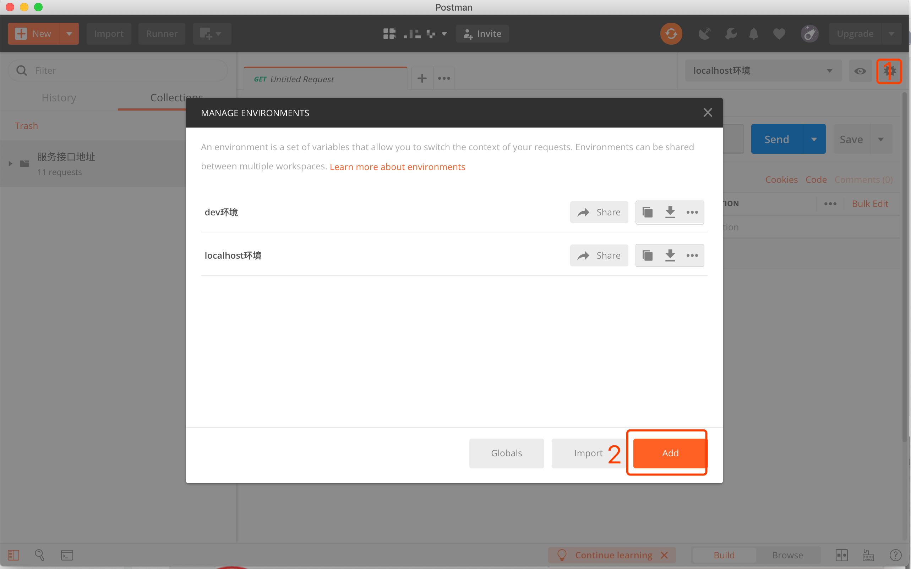
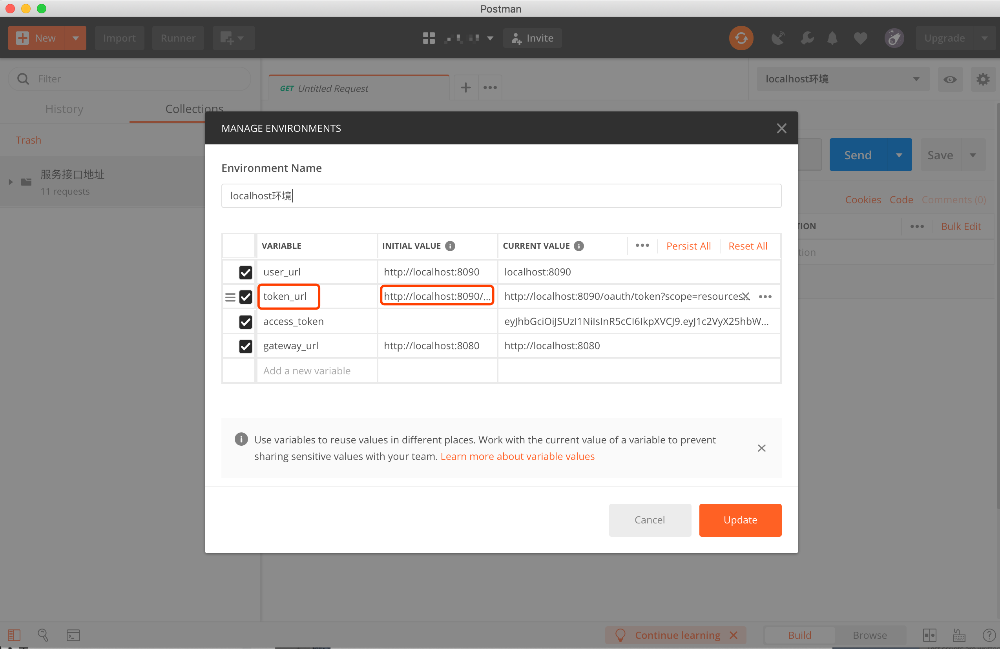
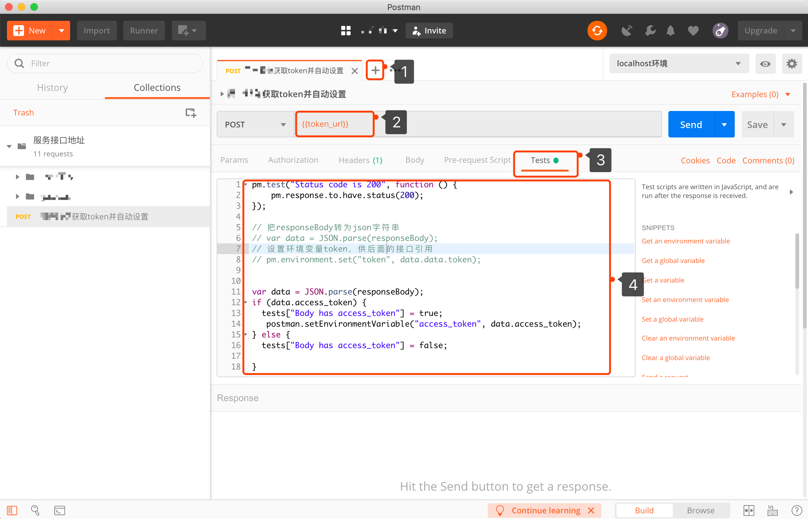
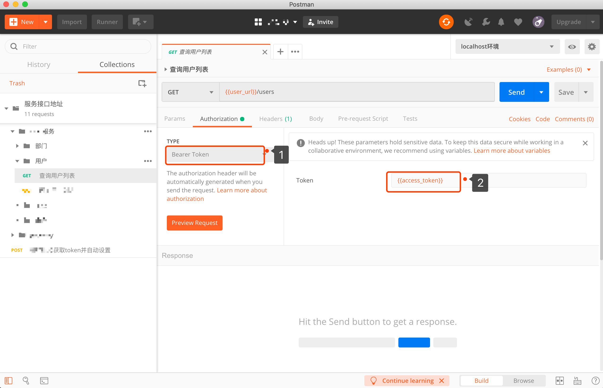

# postman设置token authorization认证信息传参<font color=#7FFF00 size=4 face="微软雅黑">【原创】</font>

#### **问题描述**
>
>  **调用服务其他接口时需要登录接口返回的access_token或token,相当于对接口进行了身份验证,
>  而且有时接口的access_token(token)每次请求后就失效需要重新获取**
>

#### **解决方案**
>  **可以把服务器返回的access_token或token设置在postman的环境变量（Environment）**


#### 步骤

#### 1.首先设置环境变量
> * 点击 Manage Environment添加环境变量



#### 2.定义变量和变量值
> * 选择添加的环境变量,定义变量和变量值(ps：token_url http://localhost:8090)



#### 3.添加请求设置定义变量
> 1. 添加一个请求
> 2. 设置 **2** 中定义的变量{{定义变量}} （ps：{{token_url}}）
> 3. 点击Tests（Tests可以理解是用来做断言的）设置获取返回body中的access_token （相关代码如下）


```javascript
pm.test("Status code is 200", function () {
    pm.response.to.have.status(200);
});
 
// 把responseBody转为json字符串
// var data = JSON.parse(responseBody);
// 设置环境变量token，供后面的接口引用
// pm.environment.set("token", data.data.token);
 
var data = JSON.parse(responseBody);
if (data.access_token) {
  tests["Body has access_token"] = true;
   postman.setEnvironmentVariable("access_token", data.access_token);
} else {
  tests["Body has access_token"] = false;

}
```

#### 3.设置需要token的请求
> * 点击Authorization 选择Type为Bearer
>   Token（不同类型token可能不同注意区分）
> * 然后在相应token位置设置 **3.3** 设置的{{access_token}}变量



---

 :red_circle: ***发送需要token的请求之前，先调用2设置的请求***

## 参考

* [https://blog.csdn.net/romon19/article/details/84662542](https://blog.csdn.net/romon19/article/details/84662542)
